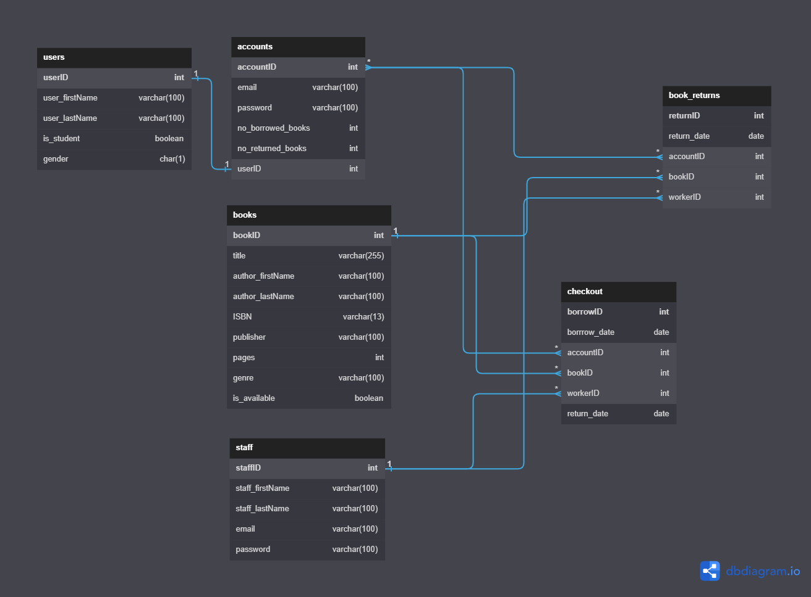
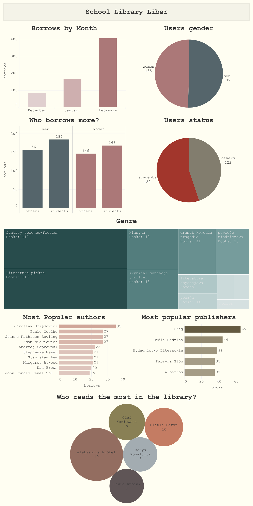

# :blue_book: Liber-School-Library_MySQL-database

## 📚 Table of Contents
- [Story](#story)
- [Entity Relationship Diagram](#entity-relationship-diagram)
- [Creating Tables & Triggers](#creating-tables-&-triggers)
- [Dataset](https://github.com/Agnieszka-Bielecka/Liber-School-Library_MySQL-database/tree/master/Dataset)
- [SQL Queries](#questions)
- [Visualization](#visualization)
***

## Story
The school library Liber is popular with students. 
Therefore, the school asked you to create a database that will store basic information. 
After that fulfill the database with data, and answer the following questions by querying to help the school library in developing its services.

The database should contain information about:
* books,
* users,
* user accounts,
* library staff.

***
## Entity Relationship Diagram

***
## Creating Tables & Triggers
Creating tables SQL queries: [Link](https://github.com/Agnieszka-Bielecka/Liber-School-Library_MySQL-database/blob/master/SQL%20Queries/Creating_tables.sql)

Creating SQL triggers: [Link](https://github.com/Agnieszka-Bielecka/Liber-School-Library_MySQL-database/blob/master/SQL%20Queries/Triggers.sql)

Triggers:
* set_unavailable,
* set_available,
* borrowed_books_counter,
* returned_books_counter.

***
## Questions
SQL Queries: [Link](https://github.com/Agnieszka-Bielecka/Liber-School-Library_MySQL-database/blob/master/SQL%20Queries/Queries.sql)

Questions:
1. How many books have been borrowed in total in the last three months?
2. How many books were borrowed each month?
3. How many users of the reading room are students of the school?
4. Who borrows more books, students or people outside the school?
5. How many men and women use the library?
6. How many books were borrowed by men and how many by women?
7. How many books of what genre are currently in the library?
8. What genres of books are most often borrowed?
9. Which author's books are most often borrowed?
10. Which publisher's books are most frequently borrowed?
11. Which readers borrowed the most books?
12. What books were supposed to be delivered by 2023-03-01 and were not?

***
## Visualization
Tableau: [Link](https://public.tableau.com/app/profile/agnieszka5169/viz/SchoolLibraryLiber/Dashboard)

